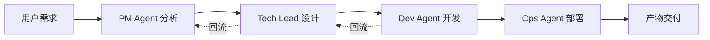

# 🐲SpineWorks

<div align="center">

**🧠 组织级 AI Agent 协同系统 | 从需求到代码的全自动化开发流程**

[](https://www.python.org/downloads/)
[](LICENSE)
[](PHASE1_COMPLETION_SUMMARY.md)

[English](#english) | [中文](#中文)

</div>

---

## 中文

### 🎯 项目愿景

SpineWorks 是一个由 **18 个 AI Agent 协同工作**的完整软件开发组织。用户只需在终端输入需求，系统即可自动完成需求分析、架构设计、代码生成、文档编写和部署方案的全流程开发。

**核心理念**: 让 AI 像真实开发团队一样协作，每个 Agent 扮演专业角色，通过标准化流程和记忆系统实现高质量的软件交付。

### ✨ 核心特性

#### 🤖 多 Agent 协同架构
- **18 个专业 Agent**: PM、Tech Lead、Dev、Ops、QA、Security 等完整团队
- **五层记忆系统**: 战略记忆、项目记忆、角色记忆、工作记忆、组织规则
- **智能回流机制**: 质量不达标自动修复，最多 3 次迭代优化
- **秘书 AGI 调度**: 全流程协调，实时进度监控，任务快照恢复

#### 🎨 现代化终端体验
- **Rich 库美化输出**: 表格、面板、进度条，视觉体验一流
- **实时进度监控**: 显示当前执行 Agent、完成百分比、预计剩余时间
- **交互式菜单**: 新建项目、查看进度、处理回流、导出产物
- **任务恢复功能**: Ctrl+C 中断后可从快照恢复，无需重新开始

#### ⚙️ 完整的管理工具
- **记忆管理**: 查看会话历史、项目详情、用户偏好
- **配置管理**: 多级配置系统，支持验证和热加载
- **日志管理**: 实时查看、级别过滤、自动轮转
- **多 LLM 支持**: OpenAI、Claude、DeepSeek、Google Gemini、百度文心、阿里通义、智谱 GLM

### 🚀 快速开始

#### 安装

```bash
# 克隆项目
git clone https://github.com/your-username/spineworks.git
cd spineworks

# 创建虚拟环境
python -m venv .venv
source .venv/bin/activate  # macOS/Linux
# .venv\Scripts\activate  # Windows

# 安装依赖
pip install -e .
```

#### 初始化

```bash
# 初始化 SpineWorks
synapse init

# 按提示配置：
# 1. 组织名称和目标
# 2. 选择 LLM 提供商
# 3. 输入 API 密钥（支持环境变量）
```

#### 使用示例

```bash
# 方式 1: 直接提交任务
synapse task "开发一个 RESTful API 服务，包含用户认证和数据管理"

# 方式 2: 使用秘书 AGI（推荐）
synapse secretary
# 进入交互式界面：
# 1. 新建项目 - 输入需求，自动生成代码
# 2. 查看进度 - 实时监控任务执行
# 3. 处理回流 - 质量不达标时修复
# 4. 导出产物 - 导出生成的项目文件

# 方式 3: 管理和监控
synapse memory list              # 查看会话历史
synapse config set secretary.max_reflow_retries 5  # 调整配置
synapse log tail                 # 实时查看日志
```

### 📋 系统架构

#### 18 个 AI Agent 角色

```
个人智囊层（3个）
├── Thought Agent - 发散思考
├── Mirror Agent - 对齐确认
└── Draft Team Agent - 构思打包

核心管理层（3个）
├── PM Agent - 需求分析 ✅
├── Coordination Agent - 任务调度
└── Prompt Engineer Agent - 提示词优化

设计层（3个）
├── Tech Lead Agent - 架构设计 ✅
├── Architecture Review Agent - 架构评审
└── UI/UX Design Agent - 界面设计

开发层（5个）
├── Frontend Dev Agent - 前端开发
├── Backend Dev Agent - 后端开发
├── Fullstack Dev Agent - 全栈联调
├── Code Review Agent - 代码审查
└── Performance Optimization Agent - 性能优化

质量保障层（2个）
├── Security Agent - 安全加固
└── QA Agent - 质量测试

交付层（2个）
├── Ops Agent - 运维部署 ✅
└── Doc Agent - 文档整合
```

#### 五层记忆系统

```
1. Strategic Memory - 组织身份和长期目标
2. Project Memory - 项目上下文和历史
3. Role Memory - Agent 特定知识和经验
4. Working Memory - 临时任务上下文
5. Institutional Memory - 组织规则和最佳实践
```

### 🎬 工作流程



### 📊 开发进度

#### Phase 1: 秘书 AGI + 核心流程闭环 ✅

- ✅ 秘书 AGI 核心实现
- ✅ 4 个核心 Agent（PM、Tech Lead、Dev、Ops）
- ✅ 回流机制和进度监控
- ✅ 终端交互界面
- ✅ 记忆系统扩展
- ✅ 配置管理系统
- ✅ 异常处理和任务恢复
- ✅ CLI 命令工具集

#### Phase 2: 个人智囊 AGI（规划中）

- 📅 Thought Agent - 发散思考
- 📅 Mirror Agent - 需求对齐
- 📅 Draft Team Agent - 需求打包

#### Phase 3-6: 完整团队扩展（未来）

- 📅 设计层 Agent（架构评审、UI/UX）
- 📅 开发层拆分（前端、后端、代码审查）
- 📅 质量保障层（安全、QA）
- 📅 复盘与增长层

### 🛠️ 技术栈

- **语言**: Python 3.8+
- **CLI 框架**: Click + Rich
- **LLM 支持**: OpenAI、Anthropic、Google、DeepSeek、百度、阿里、智谱
- **存储**: SQLite + JSON + Markdown
- **日志**: Python logging + 文件轮转
- **测试**: Pytest + 单元测试 + 集成测试

### 📖 文档

- [快速开始指南](QUICKSTART.md) - 5 分钟上手
- [CLI 命令指南](CLI_COMMANDS_GUIDE.md) - 完整命令参考
- [Phase 1 完成总结](PHASE1_COMPLETION_SUMMARY.md) - 详细实现报告
- [配置管理文档](.kiro/specs/phase-1-p2-completion/design.md) - 配置系统设计

### 🤝 贡献指南

欢迎贡献！请遵循以下步骤：

1. Fork 本项目
2. 创建特性分支 (`git checkout -b feature/AmazingFeature`)
3. 提交更改 (`git commit -m 'Add some AmazingFeature'`)
4. 推送到分支 (`git push origin feature/AmazingFeature`)
5. 开启 Pull Request

### 📝 许可证

本项目采用 MIT 许可证 - 详见 [LICENSE](LICENSE) 文件

### 🙏 致谢

感谢所有贡献者和支持者！特别感谢开源社区提供的优秀工具和库。

---

## English

### 🎯 Vision

SpineWorks is a complete software development organization powered by **18 collaborative AI Agents**. Users simply input requirements in the terminal, and the system automatically handles requirement analysis, architecture design, code generation, documentation, and deployment.

**Core Philosophy**: Make AI collaborate like a real development team, with each Agent playing a professional role, delivering high-quality software through standardized processes and memory systems.

### ✨ Key Features

#### 🤖 Multi-Agent Collaboration
- **18 Professional Agents**: PM, Tech Lead, Dev, Ops, QA, Security, and more
- **Five-Layer Memory System**: Strategic, Project, Role, Working, and Institutional memory
- **Smart Reflow Mechanism**: Auto-fix quality issues with up to 3 iterations
- **Secretary AGI Orchestration**: Full-process coordination, real-time monitoring, task recovery

#### 🎨 Modern Terminal Experience
- **Rich Library UI**: Tables, panels, progress bars for premium visual experience
- **Real-time Progress**: Shows current Agent, completion percentage, estimated time
- **Interactive Menus**: Create projects, view progress, handle reflows, export deliverables
- **Task Recovery**: Resume from snapshots after Ctrl+C interruption

#### ⚙️ Complete Management Tools
- **Memory Management**: View session history, project details, user preferences
- **Configuration Management**: Multi-level config system with validation and hot reload
- **Log Management**: Real-time viewing, level filtering, automatic rotation
- **Multi-LLM Support**: OpenAI, Claude, DeepSeek, Google Gemini, Baidu, Alibaba, Zhipu

### 🚀 Quick Start

#### Installation

```bash
# Clone the repository
git clone https://github.com/your-username/spineworks.git
cd spineworks

# Create virtual environment
python -m venv .venv
source .venv/bin/activate  # macOS/Linux
# .venv\Scripts\activate  # Windows

# Install dependencies
pip install -e .
```

#### Initialize

```bash
# Initialize SpineWorks
synapse init

# Follow prompts to configure:
# 1. Organization name and purpose
# 2. Select LLM provider
# 3. Enter API key (supports environment variables)
```

#### Usage Examples

```bash
# Method 1: Direct task submission
synapse task "Build a RESTful API service with user authentication and data management"

# Method 2: Use Secretary AGI (Recommended)
synapse secretary
# Interactive interface:
# 1. New Project - Input requirements, auto-generate code
# 2. View Progress - Real-time task monitoring
# 3. Handle Reflows - Fix quality issues
# 4. Export Deliverables - Export generated project files

# Method 3: Management and Monitoring
synapse memory list              # View session history
synapse config set secretary.max_reflow_retries 5  # Adjust config
synapse log tail                 # Real-time log viewing
```

### 📊 Development Progress

#### Phase 1: Secretary AGI + Core Process Loop ✅

- ✅ Secretary AGI core implementation
- ✅ 4 core Agents (PM, Tech Lead, Dev, Ops)
- ✅ Reflow mechanism and progress monitoring
- ✅ Terminal interactive interface
- ✅ Memory system extension
- ✅ Configuration management system
- ✅ Exception handling and task recovery
- ✅ CLI command toolkit

#### Phase 2: Personal Think Tank AGI (Planned)

- 📅 Thought Agent - Divergent thinking
- 📅 Mirror Agent - Requirement alignment
- 📅 Draft Team Agent - Requirement packaging

### 🛠️ Tech Stack

- **Language**: Python 3.8+
- **CLI Framework**: Click + Rich
- **LLM Support**: OpenAI, Anthropic, Google, DeepSeek, Baidu, Alibaba, Zhipu
- **Storage**: SQLite + JSON + Markdown
- **Logging**: Python logging + file rotation
- **Testing**: Pytest + Unit tests + Integration tests

### 📖 Documentation

- [Quick Start Guide](QUICKSTART.md) - Get started in 5 minutes
- [CLI Commands Guide](CLI_COMMANDS_GUIDE.md) - Complete command reference
- [Phase 1 Summary](PHASE1_COMPLETION_SUMMARY.md) - Detailed implementation report

### 🤝 Contributing

Contributions are welcome! Please follow these steps:

1. Fork the project
2. Create a feature branch (`git checkout -b feature/AmazingFeature`)
3. Commit your changes (`git commit -m 'Add some AmazingFeature'`)
4. Push to the branch (`git push origin feature/AmazingFeature`)
5. Open a Pull Request

### 📝 License

This project is licensed under the MIT License - see the [LICENSE](LICENSE) file for details

### 🙏 Acknowledgments

Thanks to all contributors and supporters! Special thanks to the open-source community for excellent tools and libraries.

---

<div align="center">

**当前版本 / Current Version**: v0.1.0  
**最后更新 / Last Updated**: 2024-01-30  
**开发状态 / Status**: 🚧 Phase 1 Complete, Phase 2 Planning

Made with ❤️ by SpineWorks Team

</div>
